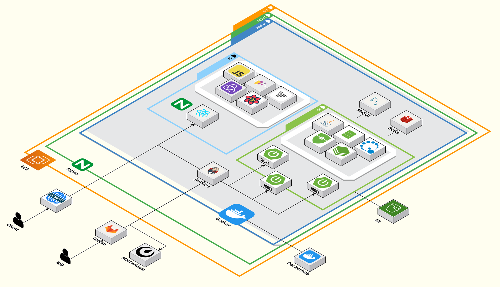
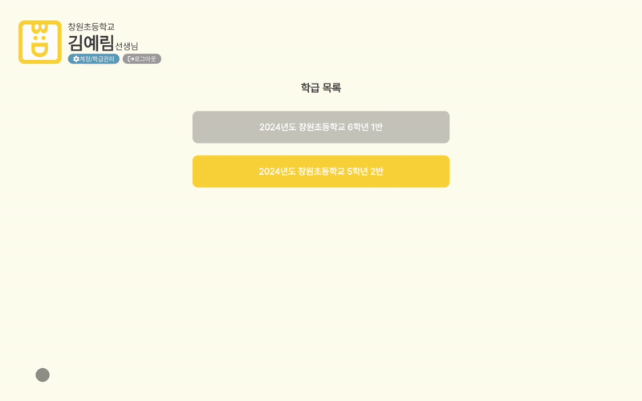
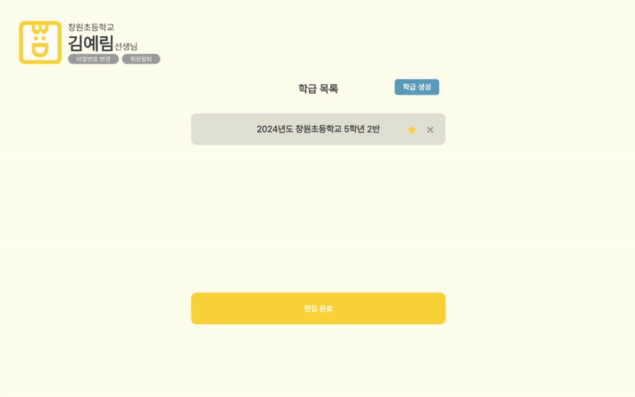
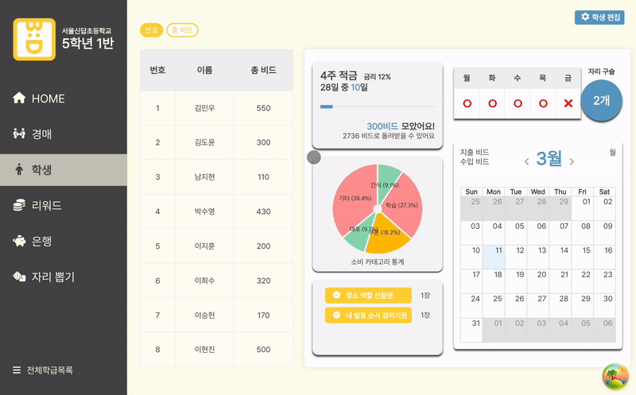
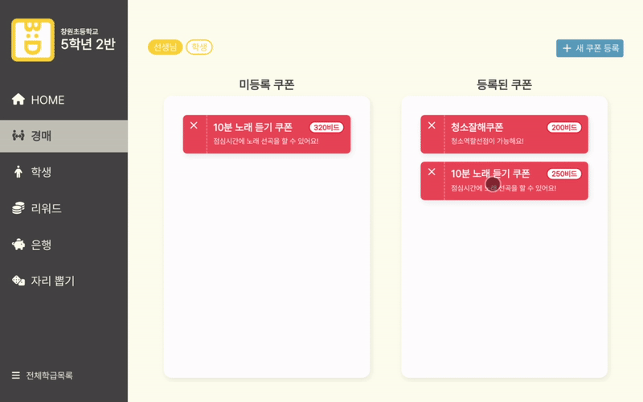
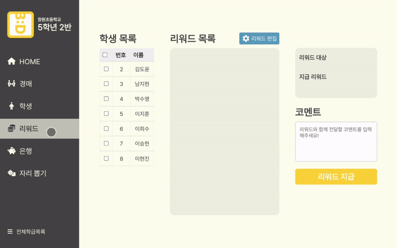
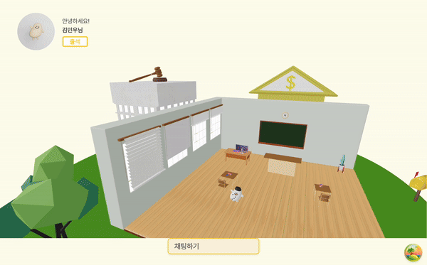

# **1. 프로젝트 개요**

> **초등학생을 위한 비밀 경매 기반 금융 교육 시스템 B:D**
> 

B:D는 기존 학급에서 사용되던 학급 쿠폰을 학생들이 게임 화폐로 직접 구입하며 자연스럽게 소비 습관을 기를 수 있는 게이미피케이션 형식의 서비스입니다.

학생들은 기본적으로 일주일마다 주급을 받으며, 직접 본인의 물건을 판매하고 선생님에게 리워드를 받으며 추가적인 수입을 얻을 수 있습니다.

학생들이 학급 쿠폰과 물건을 구입하는 방법은 비밀 경매 방식으로, 비밀 경매를 통해 학생들은 정해진 금액을 지불하는 것이 아니라 스스로 판단한 물건의 가치를 주체적으로 매길 수 있습니다.

B:D를 통해 학생들은 수입 관리과 전략적 투자의 중요성을 배울 수 있으며, 원하는 상품을 얻기 위한 효율적 투자 방법을 학습하며 경제적 의사 결정의 기초를 익힐 수 있습니다.

  

---

# 2. 사용 기술 및 설계 산출물

### 2.1 시스템 아키텍쳐

### 2.2 설계 산출물

- [포팅 메뉴얼](./docs/포팅메뉴얼.md)
- [API 명세 노션 링크](https://ahead-fascinator-914.notion.site/API-c22b893f7f614a5d9045810fa4364ca7)
- [BE 일정](/docs/pdf/BE일정.pdf)
- [FE 일정](/docs/pdf/FE일정.pdf)
- [요구사항 정의서](/docs/pdf/요구사항정의서.pdf)
- [기능명세서](/docs/pdf/기능명세서.pdf)

  

---

# 3. 주요기능

## 3.1 선생님

### 메인
- 학급에 속한 학생들의 거래량, 소비 카테고리를 확인하고 주급, 경매 진행 여부 등을 변경할 수 있으며, 학생들이 사용 신청한 쿠폰을 승인 및 거절할 수 있다.

### 메인 학급 변경
- 학급 편집 모드에서 관리자의 메인 학급을 변경할 수 있다.
- 관리자가 로그인하면 메인 학급의 상세 페이지로 연결된다.

### 학급 추가
- 등록된 학급 정보와 학생 정보를 기반으로 학급을 생성할 수 있다.

### 학생
- 학급에 속한 학생들의 리스트를 조회 및 정렬, 검색, 추가 및 수정이 가능하다.

### 쿠폰
- 관리자는 기존에 학급에서 사용하던 학급 쿠폰을 등록할 수 있다.
- 쿠폰은 Drag&Drop으로 경매에 포함 여부를 변경할 수 있으며, 등록된 쿠폰은 매일 하나씩 랜덤으로 경매에 등록된다.

### 리워드
- 학생에게 코멘트와 함께 추가적인 리워드를 지급할 수 있다.
- 학생에게 제공하는 리워드를 추가 및 삭제할 수 있다.

### 자리 구슬
- 자리 선정 순서를 랜덤으로 정할 수 있는 기능이다.
- 학생들은 기본적으로 자리 구슬을 1개씩 가지고 있으며, 매일 경매에 올라오는 자리 구슬을 경매를 통해 구입하여 본인이 먼저 뽑힐 수 있는 확률을 높인다.
- 자리 뽑기가 완료되면 자리 선정 순서를 이미지로 저장할 수 있으며, 학생들의 자리 구슬은 1개로 초기화된다.

## 3.2 학생

### 학생 경매
- 학생은 쿠폰, 자리 구슬, 아이템과 다른 학생들이 올린 물건을 구입할 수 있다.
- 아이템은 고정 금액으로, 이외의 항목들은 비밀 경매 방식으로 구입한다.
- 학생들이 올린 물건은 게시글 형태이며, 댓글을 달 수 있다.
- 경매가 중단된 시간에는 경매에 참여할 수 없다.

### 적금

- 은행 페이지에서 원하는 적금에 가입하거나 해지할 수 있다.

### 마이페이지

- 나의 월별, 카테고리별 소비를 확인할 수 있다.
- 가입한 적금의 정보와 현재 보유한 자산의 정보를 확인할 수 있다.
- 내가 소유한 아바타 목록을 확인하고, 아바타를 변경할 수 있다.

  

---

# 4. 사용 기술

[사용기술](./docs/사용기술.md)

  

---

# 5. 팀원 소개

|||||||
|:---:|:---:|:---:|:---:|:---:|:---:|
| [유현지](https://github.com/YooHyunJi)   팀장, FE  | [김예림](https://github.com/Lainlnya)   FE 리더 | [백지윤](https://github.com/1234jienf)    FE  | [이현진](https://github.com/hgene0929)    BE 리더 | [이승헌](https://github.com/olrlobt)   BE, INFRA | [배민지](https://github.com/MJBae327)   BE | 

