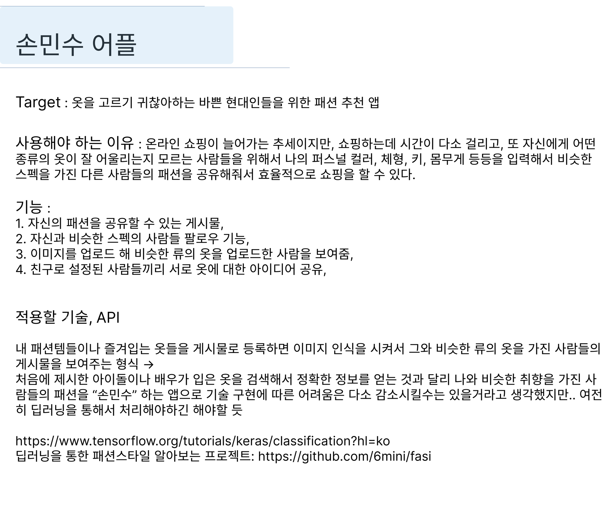
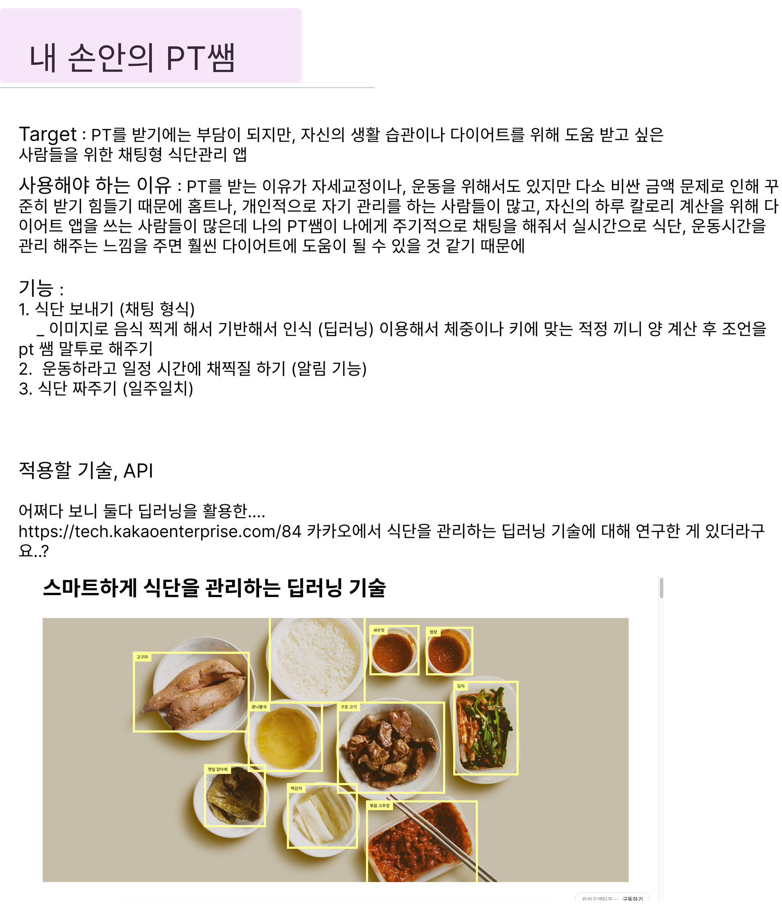

# 바로가기

```text
0108 요약

BE 기술 스택 회의
 - 백엔드 기술 스택 선정
 - 코드 컨벤션 선정
공통 
 - 브랜치 전략 선정
 - 커밋 컨벤션 선정
아이데이션
 - 학생들을 위한 SNS 채택 (고도화 작업중)

```

[TOC]


---

# ~~ 0108 이전 요약

---

## 아이데이션 1st : 브레인 스토밍

_요약이기 때문에 자세한 설명은 생략했다._

1. **손민수 어플**\
   영상이나, 사진 등에 등장한 인플루언서가 입은 옷이나 액세서리 정보를 공유하도록 함.


2. **팝업 스토어 큐레이팅/리뷰 서비스**
- 팝업스토어 리뷰 기능
- 팝업스토어 추천 기능
- 웨이팅 몇명인지 실시간으로 알려주는 기능
- 웨이팅 많은 경우 주변에 갈 수 있는 카페/음식점 등 장소 추천

3. **바른 생활**
- 기존 인스타그램은 과시 목적이 강해 상대적 박탈감을 느끼는 사용자가 많다고 느낌
- 현실적인 소비 수준 등과 먼 포스팅이 다수 있음


```text
브레인 스토밍에서 나온 아이디어와 더불어, 새로운 아이디어를 추가하여,
01/07(일)에 온라인 미팅 회의를 진행하기로 하였다.
```

<br>

---

## 아이데이션 2nd : 기존 아이디어 개선 & 추가 아이디어

## 기존 아이디어 개선

### 손민수 앱

- 상품 이미지 검색의 경우 구글 Vision API 사용하면 구현이 가능할듯 함 (https://developers.google.com/codelabs/build-product-search-backend?hl=ko#0)
- 타겟이 아이돌 팬 일 경우 : 커피차 꾸미기(가상 커꾸), 생일카페 꾸미기(가상 생카꾸), 포토카드 꾸미기(가상 포꾸) 등의 재미 기능 추가
  (필요하다면 three.js 사용하여 웹에서 3d 가능하도록)

1. [딥러닝 이미지 분류](https://www.tensorflow.org/tutorials/keras/classification?hl=ko)
2. [딥러닝을 통한 패션스타일 알아보는 프로젝트](https://github.com/6mini/fasi)



### 바른생활(개선)

- 행복 저금 : 
기분 좋은 일, 인상 깊었던 일을 기록할 시(저금통 연출)에 10원?씩 포인트를 주는 기능


<br><br>
  
## 새로운 아이디어 제시

**다음과 같은 아이디어가 제시되었다.**

### 1. 내 손 안의 PT 쌤



<br>

### 2. 반려동물 입양플랫폼
배경:

반려동물 (강아지, 고양이 포함 어떤 동물이든)을 입양하고자 할 때 입양할 수 있는 동물과 입양 절차, 주의 사항 등의 정보를 얻기가 어려워 입양에 어려움을 겪는 사람들이 있음

기능 :

- 위치 기반 가장 가까운 동물 보호소 확인 => 동물 보호소에 있는 입양 가능한 동물 확인 가능하도록 -> 입양 신청 절차도 해당 플랫폼에서 가능
- 만약 가입자가 파양 이력이 있다면 입양을 할 수 없도록 설정
- 내 성향에 잘 맞을 것 같은 반려동물 / 강아지 찾기 퀴즈(?)/게임(?) 기반 추천
- 반려동물 종류마다 채팅창 제공해서 모르는 내용은 실시간으로 주고 받으며 정보를 획득할 수 있도록 실시간 채팅 기능
- 입양 전 건강 상태 확인을 위한 병원 예약 서비스
- (추가적) 유기견/유기묘 봉사갈 사람을 모아서 같이 갈 수 있는 모임도 제공

<br>

### 3. 겟잇뷰티

### WHY

[ **조언자 관점 ]**

- 미용사(급여가 크지 않은 디자이너나 메이크업 아티스트 등), 옷가게(신생 온라인 매장 등) 사장들은 당장에는 수익이 크진 않지만, 적극적인 홍보 활동을 통해 잠재적 고객이나 단골을 유치하고자 함.
- 위처럼 전문직업인은 아니지만, 해당 분야의 학생이 또한 자신의 포트폴리오로 활용할 수 있는 경험이 필요함.

**[ 조언을 구하는 사용자 관점 ]**

- 평소 가졌던 미용 관련 고민(악성곱슬, 눈썹모양 등)에 대한 조언이 필요함.
- 옷을 추가로 구매하기 보다는 자신이 가진 옷들을 조화롭게 매칭하여 자신에게 잘 어울리는 스타일을 찾고 싶음.
- 특정한 상황(동창회, 소개팅 등)에 맞게 자신을 어떻게 꾸밀지에 대한 조언을 구하고 싶음.

### HOW

**[ 비대면 화상 뷰티 컨설팅 서비스 ]**

- 머리 손질(드라이, 고데기 등), 메이크업(눈썹정리 등), 옷 매칭에 대한 조언을 실시간 화상 채팅을 통해 구할 수 있음.
- 조언을 주는 사용자는 자신의 프로필이나 어필할 수 있는 글을 등록해두고, 타임테이블에 화상채팅이 가능한 시간대를 등록할 수 있음.
- 조언을 구하고 싶은 사용자는 어필을 통해 원하는 전문가와 상담가능한 시간대를 선택하고, 상담받고 싶은 내용을 간단히 작성하여 상담신청 할 수 있음.
- 상담을 받은 사용자는 자신을 상담해준 전문가에 대한 후기와 별점을 작성하여 등록할 수 있음.

**[ 뷰티 공유 서비스 ]**

자신의 머리 스타일이나 화장법, 옷 스타일 등을 공유할 수 있는 게시판 기능.


<br><br>

### 4. 어릴 때부터 쓸 수 있는 SNS

#### 배경 1. 스마트폰 사용 연령이 낮아지고 있다.

세부기사

- https://edu.chosun.com/m/edu_article.html?contid=2023041701399

요약 :

학부모 2100여명을 대상으로 조사한 결과,
디지털 기기의 첫 사용 연령은 3∼5세 유아가 53% 일 정도로 낮아졌고,

자녀가 성장할수록 사용 시간이 늘어났다 (75%), 자녀가 매일 사용한다 (40%), 매일 30~1시간 사용한다 (33.6%) 시간과 공간을 정해두고 사용한다. (75.7%) , 규칙을 세우지 않는다 (24.3%)
이에 부모는 **자녀의 디지털 기기의 사용**이 가져오는 이점(유용, 효과, 언어능력의 향상)보다 단점(유해성, 신체 발달에 좋지 않다)는 점이 높은 점수를 책정했다.

#### 배경 2. 초등학생 6명중 1명은 스마트폰 사용을 조절하기 힘들어 한다

- https://edu.chosun.com/m/edu_article.html?contid=2023053001355

요약 :

청소년 127만명 대상 18.1% 23만명이 스마트폰 과의존 위험군으로 분류된다.

#### 배경 3. 10대들의 미디어 SNS 이용률이 늘고 있다.

- https://www.kpf.or.kr/front/board/boardContentsView.do?board_id=246&contents_id=29ff236264724e3fbe02e544185aac03

요약 :

대부분의 청소년이 온라인 동영상 플랫폼(97.4%), 인터넷 포털(97.3%), 메신저 서비스(95.8%)

#### 배경 4. 태블릿으로 학습하는 시대. 2025년까지 1인 1태블릿 보급

2025년 중,고등 1인 1태블릿

- https://mobile.newsis.com/view.html?ar_id=NISX20220831_0001997222

2025년까지 서울 초등 1인 1 태블릿

- https://www.newspim.com/news/view/20231024000161

```text
시대가 발전함에 따라 이제는 태블릿으로 학습하는 시대가 왔다.

시대가 발전하면서 당연히 따라오는 효과이고, 이를 부정하기 보다는 보완하여,
학생들이 올바른 방향으로 디지털 미디어를 접하도록 할 수 있었으면 좋겠다.
```

### 기능

1. 성장 기록
    - 어릴 때 사진을 기록하여, 성장 과정을 사진으로 남겨주는 기능
        - 난 어릴 때 사진이 없다. 카메라와 연동하여, 일정 주기(생일)에 따라 성장 셀카를 찍을 수 있게 독려한다면, 나중에 좋은 추억이 될 것 같다.
        - 챌린지 느낌으로.
    - 친구를 태그한 사진을 올린다면, 해당 친구의 성장 기록에도 자연스럽게 기록된다.

2. 디지털 미디어
    1. 미디어 자막 기반 필터 기능
        - 디지털 미디어를 똑같이 노출 시켜준다. 이 것이 디지털 미디어를 이용하는 주 된 이유이기 때문에.
        - 하지만, 자막을 따와서 내용을 요약하고, 해당 내용이 학생들한테 유해하지 않을 지 평가를 매겨 진짜 노출할 지 말 지를 결정해준다.

1. 피드
    1. 맞춤법, 표현 보정 기능
        - 글을 작성할 때, 맞춤법과 띄어쓰기, 적절한 표현 등을 제시해준다.
        - 강요하지 말고, 적절히 선택할 수 있도록 만들어서 자연스럽게 언어 능력을 올려주면 좋을 것 같다.
    2. 개인 일기
        - 하루를 기록하는 습관을 독려한다.
        - 기분은 어땠는지, 무엇을 했는지, 기록하면서 자연스럽게 자신이 무엇을 좋아하고 무엇을 싫어하는 지 알 수 있게 될 것 같다.

1. 학습 노트
    1. 잔디 기반의 학습 노트
        - 스트릭을 서서히 채우도록 학습을 독려한다.
        - 학교에서도 숙제나, 공지 등으로 사용할 수 있게 만들어도 좋을 것 같다.

1. 신체 활동 독려
    1. 움직임을 통한 간단한 게임 제공?


```text
투표 결과에 따라 약간의 구체화를 거쳐 컨설턴트님의 컨펌을 받기로 하였다.

--- 투표 결과 ---
바른생활 3표
겟잇뷰티 2표
내손안피티쌤 1표
```


---

# 0108

## 1. BE 기술 스택 회의

### 백엔드

**기술스택**

1. 언어 : Java 17
2. 프레임워크 : 스프링부트 3.2.1(미정)
3. 라이브러리 : spring-data-jpa, spring-security, query dsl
4. 데이터베이스 : 뭐든..!, redis
5. 각자 하고 싶은 것 : 채팅 / 대용량 데이터 관리

**CICD**

EC2, Jenkins, Docker, S3

**기타**

테스트 : 서비스 코드에 대한 테스트 코드 작성, API 테스트(포스트맨)

```text
각자 기술 스택과 하고싶은 기술을 위주로 공유를 진행하고, 희망 스택을 작성했다.
추후, 주제가 정해짐에 따라 상세를 변경하기로 하였다.
```

**코드 컨벤션**

네이버 컨벤션 사용

```text
코드 컨벤션에서 네이버와 구글을 고민하였는데,
팀원중 이미 네이버 코드 컨벤션을 써 본 인원이 있고, 한글로 상세히 작성되어 있는
네이버 코드 컨벤션을 따르는 것이 팀에 더 도움이 될것이라 판단하여
네이버 코드 컨벤션을 따르기로 하였다.
```


### 공통

**브랜치전략  (**https://techblog.woowahan.com/2553/)

master : 제품으로 출시될 수 있는 브랜치\
develop : 개발 중인 브랜치\
feature : 기능을 개발하는 브랜치

- feature/기능이름 형식으로 작성하여 각 기능을 세부적으로 나눔.

**커밋 컨벤션 (**[https://velog.io/@shin6403/Git-git-커밋-컨벤션-설정하기](https://velog.io/@shin6403/Git-git-%EC%BB%A4%EB%B0%8B-%EC%BB%A8%EB%B2%A4%EC%85%98-%EC%84%A4%EC%A0%95%ED%95%98%EA%B8%B0)**)**

**`태그 : 제목`의 형태이며, `:`뒤에만 space가 있음에 유의한다.**

ex) `feat: 로그인 기능`

| 커밋 유형 | 의미 |
| --- | --- |
| feat | 새로운 기능 추가 |
| fix | 버그 수정 |
| docs | 문서 수정 |
| style | 코드 formatting, 세미콜론 누락, 코드 자체의 변경이 없는 경우 |
| refactor | 코드 리팩토링 |
| test | 테스트 코드, 리팩토링 테스트 코드 추가 |
| chore | 패키지 매니저 수정, 그 외 기타 수정 ex) .gitignore |
| design | CSS 등 사용자 UI 디자인 변경 |
| comment | 필요한 주석 추가 및 변경 |
| rename | 파일 또는 폴더 명을 수정하거나 옮기는 작업만인 경우 |
| remove | 파일을 삭제하는 작업만 수행한 경우 |

```text
내가 따르고 있고, 써 보았던 커밋 컨벤션과
쓰고 싶었던 브랜치 전략을 팀원들과 공유하여
앞으로 사용하기로 하였다.

시간 관계상 프론트팀과는 정확한 소통을 못 해서 내일(240109) 전달 하여 확정 지을 예정이다.
```

<br><br>

## 2. 아이데이션 3rd

```text
예상치 못하게 모두의 아이디어를 컨설턴트님께 컨펌을 받았다.

우리의 아이디어는 모두 좋은 부분이 있는 반면, 부족한 부분도 많아서
모든 아이디어를 각각 하나씩 돌아가며 고도화 시키는 작업을 통해 아이디어 선별 작업을 거쳤다. 
```

### 유현지 - 바른생활

- 사용자가 데이터를 기록하는 방식
- 기록한 데이터를 활용하는 방식
- **이 서비스를 들어오게끔 하는 요소가 필요할 것 같다.**

---

### 이현진 - 겟잇뷰티

- 홍보를 위한 수단
- 진단 시 초기 상태에 따른 결과 변동 가능
- **화상 채팅과의 차별점 고려해야함.**
- AI를 쓴다면 이질감 해결과 같이 기존 기능보다 좋은 기능이어야 할듯

---

### 백지윤 - 내 손 안의 PT쌤

- 초기에 BMI 정보 입력받기
- 원래 먹던 식단 이미지 입력받기
- 내 이미지를 캐릭터로 만들기 → 살빠지고 찌는것에 따라 찌고빠지기
- 양 , 음식 카테고리 분류 ,

#### Q. 국의 깊이는 어떻게 알 것 인가?

#### Q. 3층의 닭가슴살은 어떻게 알 것 인가?

---

### 이승헌 - 학생을 위한 SNS

[GitHub - Isanghada/ModooStock: 🏆 SSAFY 8기 자율프로젝트 우수상 '모두의 주식'](https://github.com/Isanghada/ModooStock?tab=readme-ov-file)

[요즘 잘파 세대가 쓰는 용돈 관리 앱 ‘퍼핀’ | 요즘IT](https://yozm.wishket.com/magazine/detail/2283/)

[](https://namu.wiki/w/리틀팍스)

- 메타버스 형식
- 주식 개념

- 원하는 관광지, 먹고싶었던 음식들 주문 기능

### 타겟

학생

### 메인 서비스

메타버스 내에서 주식 등과 같이 학습하기 어려운 주제를 자연스럽게 익힐 수 있게 함

---

### 김예림 - 반려동물 입양

- 포인핸드를 이길 방안 ?…

---

### 배민지 - 팝업스토어

[heyPOP l 헤이팝](https://heypop.kr/)

[POPPLY | 팝플리 - 팝업스토어 플레이스 리스트](https://www.popply.co.kr/)

[팝업스토어 NO.1 가치공간 - 온라이프(On-Life) 리테일 플랫폼](https://www.valuevenue.co.kr/)

- 데이터를 크롤링 해 올 수 있는 대안을 찾으면 좋을 듯.

```text
아이디어 각각 하나씩 고도화 시키는 작업을 통해, **학생들을 위한 SNS**가 모두가 하고 싶어하는
아이디어에 적합하다는 결론이 나왔다.

이에 내일(240109)까지 추가 아이디어 하나씩을 갖고 회의를 하기로 하였다.
```
