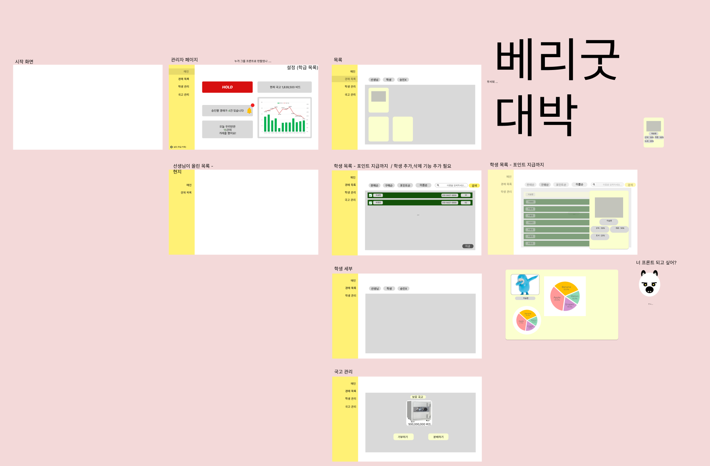

# 0112

```text
요구사항 명세 작성 시작
추가기능( 자리 바꾸기 기능 )에 대한 토론
피그마 제작 시작
```


---


관리자(선생님)

1. 회원가입
2. 로그인
3. 관리중인 학급 목록
4. 학급 상세
    1. 경매 목록 탭 기준 구분( 선생님이 올린 목록 | 학생들이 올린 목록 - 승인 전/후 경매 목록 )
        1. 경매 승인
        2. 경매 등록

1. 경매 목록 탭 기준 구분( 선생님이 올린 목록 | 학생들이 올린 목록 - 승인 전/후 경매 목록 )
2. 경매 등록
3. 경매 승인
4. 경매 거절
5. 경매 홀드
6. 리워드 분배

참여자(학생)

- 경매 자리 시스템

배민지 : 중립 한다면 단기 

김예림 : 반대

유현지 : 

백지윤 : 장기로 같은 경매 느낌을 살렸으면 좋겠다.

이현진 : 자리라는 시스템 자체가 메인을 헤친다.

이승헌 : 단기. 

대포알 자리뽑기

- 하루에 하나씩 경매장에 올라오고, 대포알이 많을 수록 당첨될 확률이 올라간다.


