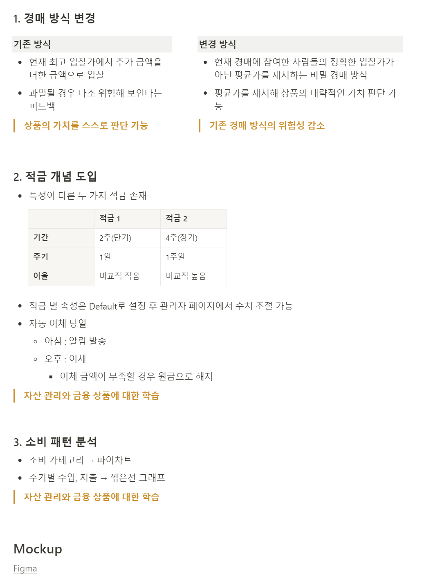
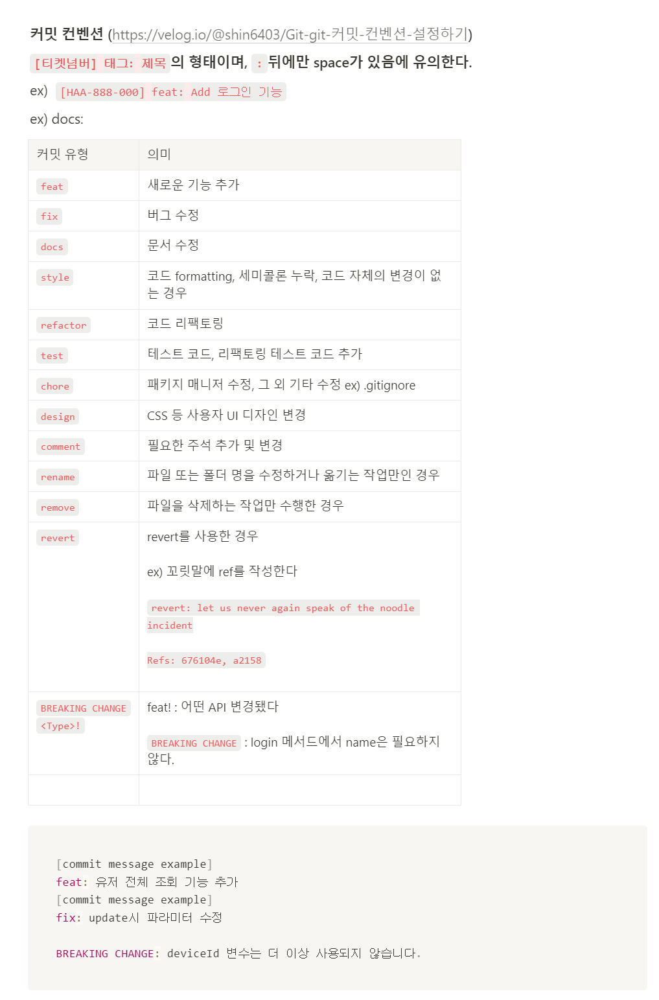

# 0116

```text
오전 미팅
요구사항 명세 제작

깃 컨벤션 작성,
자라 시작
```

---

## 1. 오전 미팅 준비



> 오전 미팅으로 적금과 같은 추가기능보다
> 경제 교육이 될만한 기능에 집중해야 한다는 피드백을 받았다.


```text
1. 발표순서 선택권과 같이 우리 서비스에서만 할 수 있는 독창적인
기능을 위주로 디벨롭이 필요할 것 같다.

실제 쿠폰들을 리스트업 해보면 좋을듯

> 실제 쿠폰들로 대략 50가지를 리스트업 하기에는 학생들의 실제 참여를
우리의 서비스로 할 수 있는 쿠폰들이 많이 없다고 생각된다.
따라서, 본 기획의 경매 서비스는 살리고, 쿠폰 가짓수를 늘려 보완하기로
결정하였다.

2. 기능 사용의 유도
이자를 가져가면서 쿠폰을 더 살 수 있게끔 유도.
선생님들이 원 클릭으로 설정 하거나 번거로운 작업을 줄이도록 유도.
서비스 사용이 더딘 학생들을 위한 사용 유도.

> 학생 개인변 분석 그래프를 기반으로 사용을 유도할 수 있는 기능이 있으면
좋을 것 같다.

3. 화폐의 가치
화폐의 가치는 끊임없이 논의하던 주제였는데,
자금을 초기화 하는 등의 방안 논의가 필요하다.

```

1. 관리자가 검열해야할 부분이 크다

   → 관리자가 경제에 대해서 잘 몰라도 잘 관리할 수 있도록 기능 제공.

    - 학급에서 가진 재산 하위 00% 인 학생들만 보여주는 형식? 그래서 복지 차원에서 00비드 지급 유도 방안?

1. *경매 대상은 물품 X → 쿠폰 형식으로*

   *→ 쿠폰 리스트업*

    - *한 8개 쿠폰 리스트업하고, 학생은 경매 등록 할 수 없도록?*
    1. 자리 정하기
    2. 내 발표 순서 정하기
    3. 청소 역할 순서 정하기
    4. 급식 먼저먹기
    5. 하루 자리 바꾸기
    6. 노래 선택 쿠폰

1. *시스템 활성화*
- *학생이 리워드를 지급받으면 알림을 통해 리워드 내역을 표출한다.*

  *Ex. 승헌이가 숙제잘해와상 으로 100비드 상금을 받았어요~!*


1. ~~리워드 지급 → 화폐가치의 문제~~

2. 노래신청 쿠폰 >> 노래 신청 리스트


---

## 2. 데일리 todo
### 오늘 계획

- [x]  추가 기획(12:20-13:00)
- [x]  요구사항 명세(13:00- 16:00)
- [ ]  지라 세팅(17:00-17:30)
    - 인당 40포인트 배당
    - 서브태스크, 에픽에는 포인트 배당하지 말 것
    - 스토리에만 배당
    - 이슈 타입 관련 컨벤션 생성 권장
- [ ]  세부기능 명세
- [ ]  와이어프레임 / ERD
- [ ]  API 문서(16:00-17:00)
- [ ]  스케줄 → 지라


### 주 단위로 계획 짜기

- 1월 3주차 (1/15 ~ 1/21)
    - FE : Figma 완성본 제작, 구조 작성 완료.
    - BE : ~~EC2 신청~~,  개발시작 환경세팅(로컬) → CICD 환경  구축
    - ALL : 요구사항 명세, 시스템 설계, 와이어프레임, API 문서.

```text
구체적인 계획을 짜려고 했으나, 기능 요구사항이 나와야 구체적인 계획
리스트업이 가능할 것으로 판단하여, 첫 주 까지만 작성하였다.

```


---

## 3. 깃 컨벤션

기존에 사용해 보았던 컨벤션을 공유하고, 같이 사용해 보기로 하였다.
잘 모르는 것은 바로바로 물어보아 서로 합의하는 방향으로 진행하기로
하였다.


