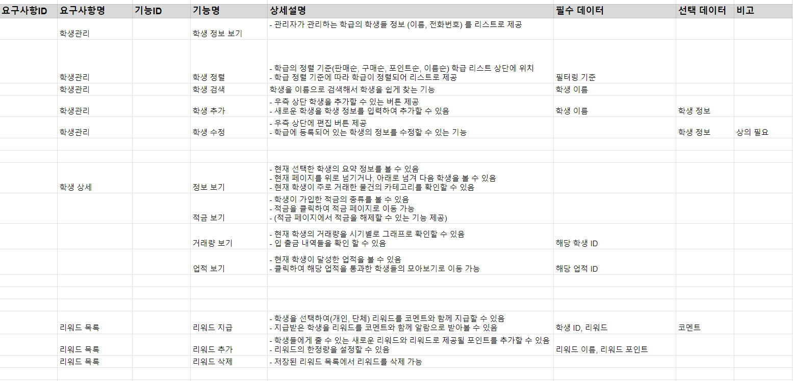

# 0117

```text
요구사항 명세 마무리
요구사항 명세 취합
기능 요구사항 명세 시작

16:00 ~ 16:30 정기면담 3차

```
---

## 1. 요구사항 명세 마무리



학생관리, 리워드 부분 요구사항을 마무리하고 전체적인 취합 과정을
조원 다 같이 진행하였다.

요구사항과 기능 명세는 우리 팀원들의 생각을 일치시키는 것이 중요하기
때문에, 시간이 오래 걸리더라도 감수하기로 하였다.

---

## 2. 요구사항 취합


( 일부 생략 )


요구사항 취합 과정을 거쳐, 모든 요구사항을 검토하고 취합했다.
이 과정에서 많은 부분이 바뀌고,
세세한 요구사항이 작성되었다.

---

## 3. 정기면담 3차

```text
3차 정기면담을 실시하였다.

전반적으로 2학기 진행에 관한 것과
앞으로의 목표, 싸피에서의 생활 등에 관한 상담을 진행하였다.

이 상담으로 내가 싸피에 온 목표와 앞으로 어떻게 할 것인지에 대해
다시 한 번 생각하게 되었다.
```
