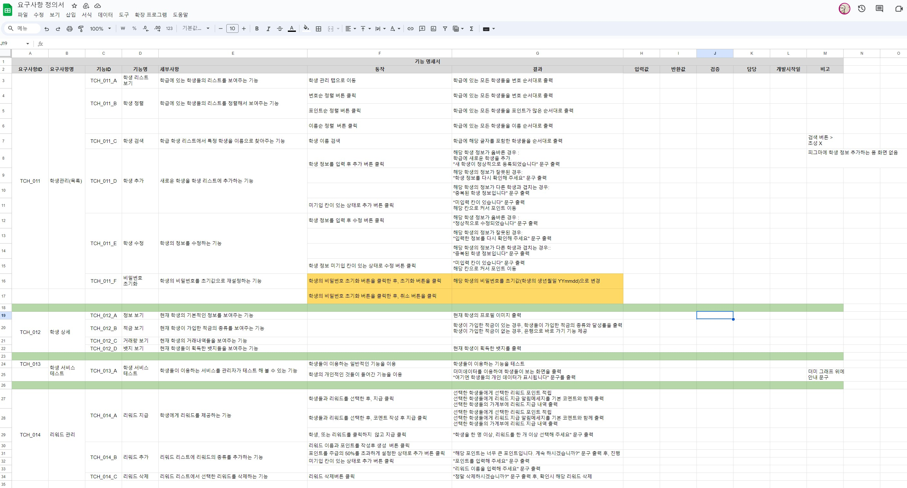

# 0118

```text
기능 명세서 작성
기능 명세서 피드백, 검토
BE 금주 마무리 계획
```

---

## 1. 기능 명세서 작성, 피드백, 검토
 
 
작성한 요구사항을 바탕으로 기능 명세서를 작성하였다.

기능 명세를 작성하면서, 또 다시 기능의 상세에 관해 생각하게 되었고,
여러가지 기능들의 상세를 수정하였다.

또한, 여섯 팀원이 작성한 기능 명세를 다 같이 보면서
형식을 맞추고, 수 많은 피드백을 기반으로 수정을 진행했다.

기능 명세서 작성을 통해 여섯명의 팀원들 모두가 같은 서비스를 바라보고
생각하고 있다는 것을 느꼈다.


## 2. BE 금주 마무리 계획

내일 기능 명세가 마무리 되는대로

엔티티 설계, ERD 설계를 진행하고
역할을 분담하기로 하였다.

이 외에도 주말까지 아키텍쳐 설계 등 필요한 BE 수행 작업들을
계획하였다.