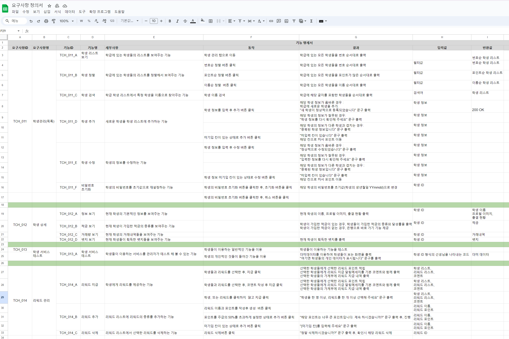
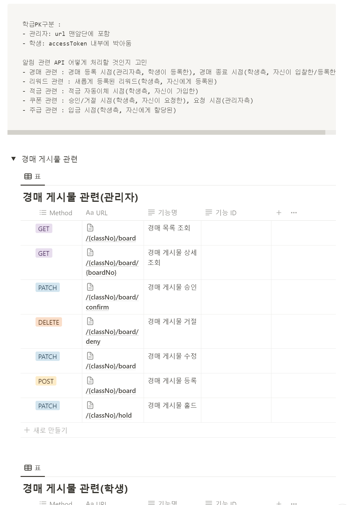

# 0119

```text

누락된 기능 명세 부분 리스트업
기능 명세 마무리
API 설계

```

---

## 1. 누락된 기능 명세 부분 리스트업

### To do…

**공통**

- [ ]  누락된 기능에 대한 기능 명세서 작성

  화면에 포함되지 않는 기능에 대한 명세 누락되어 있음

   👩🏻‍🏫 **관리자**
   
  ---

    - [ ]  자동 알림 발송 → 명세작성 필요
    - [ ]  자동 이체
    - [ ]  자동 HOLD → 명세작성 필요
    - [x]  쿠폰 사용 처리
    - [x]  학교 변경

   🧒🏻 **학생**
   
  ---

    - [ ]  낙찰 ⇒ 요부분을 생각해야겠다..
    - [x]  뱃지 취득
    - [x]  쿠폰 사용 신청 → 쿠폰마다 사용버튼? 그러면 선생님 알림?
        - ~~관리자 페이지에 쿠폰 사용 신청 내역 확인할 수 있는 기능이 필요해 보임~~
        - ~~쿠폰 사용 신청은 승인이 필요한가?~~
            - ~~필요하다면 승인 처리 전 취소할 수 있는가?~~
        - ~~쿠폰 사용은 사용 희망 전날에 해야 하는가?~~
            - ~~아니라면 사용 희망 날짜를 직접 설정할 수 있는가?~~

            ---

        - 학생 : 쿠폰 사용 신청
            - 선생님 : 웹 푸시 알림 & 페이지 대시보드에 쿠폰 신청 알림
                - 각각의 신청에 대해 승인/거절 선택
                    - 승인 : 학생 보유 쿠폰에서 해당 쿠폰 수량 -1
                    - 거절 : 학생 보유 쿠폰 유지

      개인 알림:

        - 선생님한테 리워드 받았을때
        - 본인이 참여한 경매가 종료되었을때
        - 본인이 올린 경매  종료되었을때
        - 적금 자동이체 알림
        - 쿠폰 승인/거절 되었을 때
        - 주급 입금 알림
   </aside>


- [ ]  기능명세서 취합
- [ ]  FE/BE 차주 계획 수립
- [ ]  개인별 Jira 스토리 포인트 분배

**BE**

- [ ]  API 명세 작성
- [ ]  ERD 작성

**FE**

- [ ]  플로우차트 제작 → 누락된 화면 파악

   <aside>
   👩🏻‍🏫 **관리자**
   
  ---

    - [ ]  회원가입 페이지
    - [ ]  아이디 찾기 페이지
    - [ ]  비밀번호 변경 페이지
    - [ ]  쿠폰
        - [ ]  사용 처리 페이지/모달
        - [ ]  당일 사용 예정 쿠폰 열람 모달
    - [ ]  회원 탈퇴 페이지
    - [ ]  학교 변경
        - [ ]  학교 변경 페이지
        - [ ]  학교 검색 모달
   </aside>

   <aside>
   🧒🏻 **학생**
   
  ---

    - [ ]  쿠폰 사용 신청 버튼
   </aside>

- [ ]  디자인
    - [x]  컬러팔레트 제작
    - [ ]  폰트 결정
    - [x]  로고
    - [x]  파비콘(로고 동일)
- [ ]  파트 분배 후 목업 제작

---

## 2. 기능 명세 마무리



내가 맡은 학생관리, 학생상세, 학생 서비스 테스트, 리워드 관리 부분의 기능 명세를 마무리 하였다.


---
## 3. API 설계

팀원들이 작성한 기능 명세를 바탕으로 API 설계를 BE 팀에서 진행하였다.




( 일부 생략 )

상단에 개발에서 헷갈릴 부분이나, 고민들을 적어놓고
하단으로 노션 DB시스템을 이용하여 분담하여 API 설계를 시작하였다.

```text
설계에 관한 지식이 많이 부족하여, API설계를 먼저 해야할 지
ERD를 먼저 그려야할 지 많이 고민하였다.

ERD를 먼저 설계하면 변수명과 클래스명을 일치시킨 상태로 API 설계를 할
수 있다는 이점이 있고,

API 설계를 먼저 하면, ERD 설계에 필요한 데이터들을 미리 리스트업 시킬
수 있다는 이점이 있는데,

무엇을 먼저 해야한다는 명확한 답은 없고,
 프로젝트와 팀의 성향에 따라 결정하면 된다고 한다. 

```


---

### 240119 개인회고

KEEP(지속할 것)
```
1. 처음으로 개인회고를 진행하고나니 어제 하룻동안 느꼈던 진행에서의 문제점을
하루만에 바로 잡을 수 있었다. 오늘은 어제와 다르게 표준을 정하고, 
예시를 한 두개 같이 진행 한 뒤 분업을 진행해서 효과적이라고 느꼈다.

앞으로도 개인 회고를 통해 하루를 정리해야겠다. 

2. 팀 내에서 모르는 문제가 발생하면 팀원 모두 적극적으로 나서서 해결해준다.
지라, 깃에서 모르는 부분이 있어서 물어보았을 때, 다들 적극적으로 문제를 해결해주려
노력하는 모습을 보았다. 우리팀 짱

```


PROBLEM(문제가 된 것)
```
1. 설계에 관한 지식이 부족하여, 설계 진행중에도 진행 순서에 대해 의문이 많이 들었다.
ERD와 API 설계 중 무엇이 선행되어야 하는 지 많이 고민한 점이 오늘 가장 문제가 되었다고
생각한다. 설계에 대해 더 공부해야겠다..

> 알아본 결과, 명확한 답은 없다!
> 하지만, 보통 데이터 모델링(ERD)을 선행하는 경우가 일반적이라고 한다. 

2. API 설계에서 진행 정도를 확인하면서 작업하지 않았다.
어디가 완료된 작업인지 명시하지 않아, 내가 다음에 어디를 해야할 지 헤매버렸다.
```


TRY(다음에 시도할 것)
```
1. 코치님들께 적극적인 질문을 해야겠다.
우리가 모르는 부분을 알려주는 것이 코치님들의 역할인데,
적극적으로 질문을 해서 팀 프로젝트 속도를 높여야겠다. 

2. 무슨 일이던 진행 정도를 항상 표시하고 공유하여 진행에 차질이 없도록 해야겠다.
```