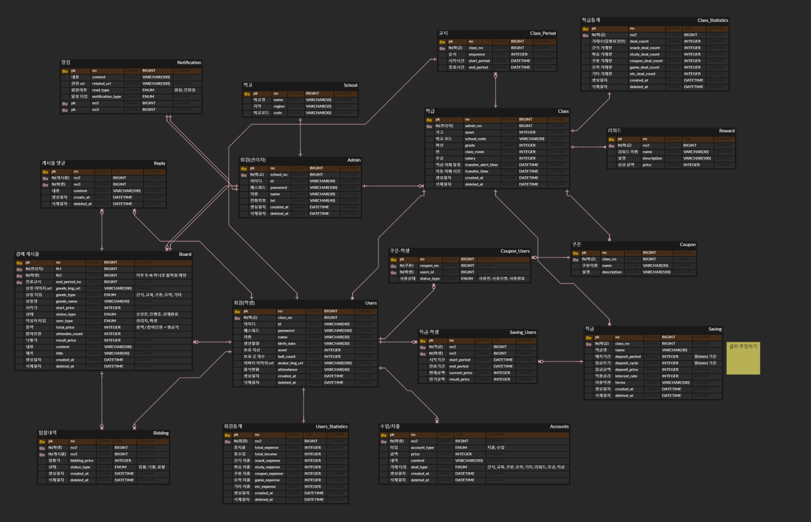
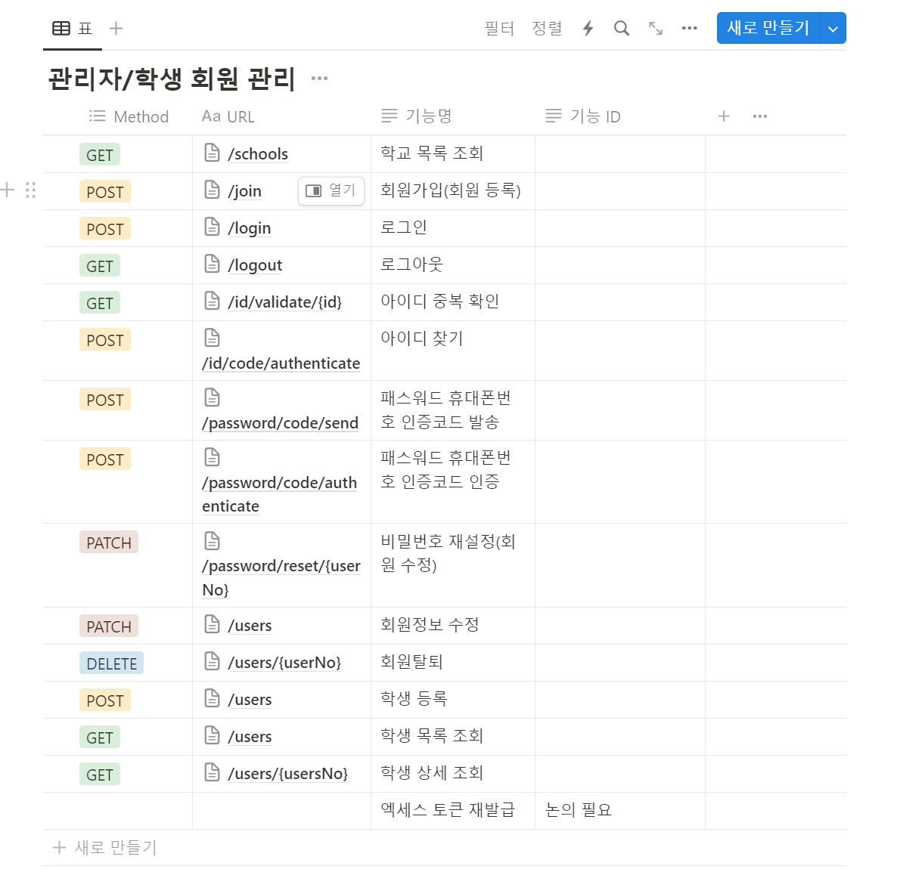

# 0122

```text

ERD 작성
API 명세 완료

```

---

## 1. ERD 작성

주말간 1차 ERD 생성을 완료하고,
BE 팀원들과 다같이 ERD를 보면서 ERD를 완성하였다.





고민이 되었던 부분은 다음과 같다.

1. 선생님(관리자)와 학생(일반유저)의 테이블을 별개로 할 것인가

- 회원(선생님과 학생) 모두 게시글을 작성하거나, 알림을 받는 등 중복되는 일이 많기
때문에, `구현 클래스마다 테이블 전략` 을 사용하기로 했다.

> 하지만 구현 클래스마다 테이블을 만드는 전략은 조회부분에서 상당히
> 성능이 느려진다는 단점이 있고, 상속의 의미가 없어지는 전략으로
> 사실상 쓰지 말라고 권고하는 전략이라고 한다.
> 
> 따라서, 우리가 사용하기에 적합한 전략은 모든 구현체를 하나로 합치는
> 단일 테이블 전략이 아닌가 생각이 든다.
> 
> 내일 가서 BE 팀원들과 이야기 해 보아야 겠다.

---

## 2. API 명세

지난번 같이 만들었던 API 명세를 바탕으로 BE 팀장이 개인적으로 디벨롭을 진행 해 왔다.
RESTful 하게 URL을 설계 해 왔고, 세세한 부분만 같이 검토를 진행하였다.



( 일부 생략 )

검토를 바탕으로 API 명세 작성을 거의 완료하였다.
내일 최종으로 확인하고 진행한다면 좋을 것 같다.

> API 문서화 툴 이야기 해보기 !


---


### 240122 개인회고

KEEP(지속할 것)
```
1. 팀원들 모두가 각자 주말간 알게모르게 프로젝트와 관련한 작업들을 진행해왔다.
덕분에 동기부여가 많이 되고, 더 열심히 참여해야겠다는 생각이 많이 들었다.
```


PROBLEM(문제가 된 것)
```
1. 되나? 라고 확신이 안 서는 상황에서 혼자 너무 생각을 오래 한다. 제대로 된
지식이 없는 상황에서 시간을 너무 오래 끈 것 같다.
```


TRY(다음에 시도할 것)
```
1. 궁금한것 좀 혼자 생각하지 말고, 바로 물어보거나 검색 좀 해보겠다고 말하고
검색해야겠다.
```