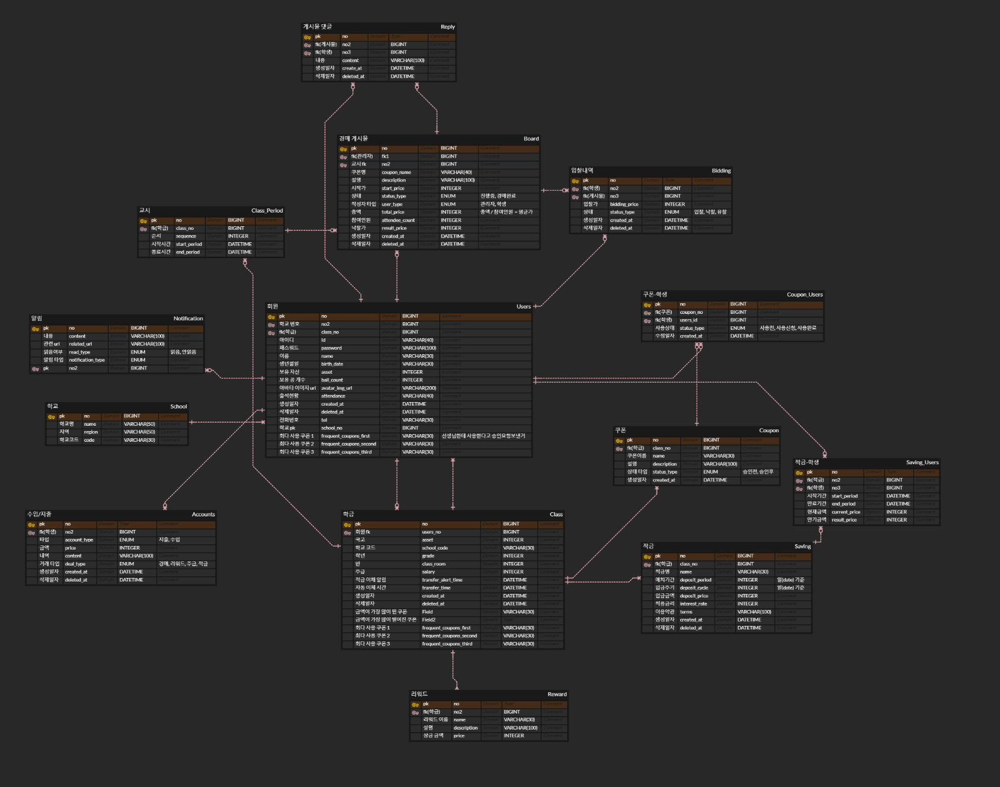

# 0123

```text
오전 미팅(10:00 ~ 11:00)
ERD 재설계
API 명세 재작성
BE 업무 분담
```


---

### 1. 오전 미팅

오전에 설계부분 첫 미팅을 진행했다.

1. 요구사항명세
2. 기능 명세
3. 전체 일정
4. 지라
5. ERD
6. API 명세
7. 피그마

순으로 진행되었으며, 1~4 의 경우 팀장님의 순조로운 진행 덕분에 큰 칭찬을 들었다.

5. ERD

ERD 부분의 경우, 1 대 1 매핑의 필요성에 관한 질문이 들어왔다.\
어제 찾아 본 결과, 상속 관계를 정의하는 과정에서 전략 선택이 잘못된 부분이 있었는데,
그 부분을 명확히 이해하기 쉽게 설명해주셔서 도움이 많이 되었다.

또한, FK 사용의 필요성에 관한 질문도 해주셨는데,\
FK 사용이 실제로는 하지 않는다는 것을 얼핏 들은적은 있지만, 왜 그런지에 관해
정확히 아는 부분이 없었는데, 이에 관한 설명도 자세히 듣게 되었다.

이 부분에 관해서는 따로 정리해서 블로그에 게시하고,
이 부분을 우리의 ERD에 적용해서 다시 컨펌 받을 예정이라, 오늘 따로 정리는 생략한다.


### 기능 개선 (현물 X -> 쿠폰 O)

현물을 거래하는 것에 대한 부정적인 효과들을 생각해 보아야 한다.

학생들이 거래를 주로 하는 이유가 현물을 사기 위해서가 되어서는 안 되는 느낌을 받았고,
무형의 것에 가치를 부여하여 쿠폰 형식으로 거래를 전환하기로 하였다.


이에 따라, 각 명세들을 수정하고, ERD를 수정하는 작업을 진행했다.


---

### 2. ERD 재설계

기능이 바뀜에따라 ERD를 재설계 했다.

다만, 1대1 매핑과 상속전략, FK생략에 관한 지식이 부족한 것 같아서
1차적으로 마무리하고 개인 공부 이후에 다시 이야기 해 보기로 결정했다.





---

### 3. API 명세

API 명세 수정을 진행하면서, 분담의 중요성을 느껴 분담을 진행했고,
분담결과를 바탕으로 API명세를 작성해 오기로 하였다.

내일 취합 예정이다.


---

### 4. BE 분담

분담을 바탕으로 API 명세와 JIRA 수정을 진행할 계획이다.

배민지 : 
1. 로그인
2. 로그아웃
3. 출석
4. 활동 내역 조회
5. 아바타 관리 
6. 학급 정보 조회 
7. 회원가입 
8. 로그인 
9. 회원 탈퇴 
10. 학급 목록 열람 
11. 학급 편집 모드 
12. 학급 등록


이승헌 :

1. 나의 경매 정보
2. 경매 게시물 목록 조회 
3. 경매 게시물 상세 조회 
4. 경매 게시물 등록 
5. 경매 진행 통제 
6. 경매 게시글 관리 
7. 경매 등록 
8. 쿠폰 도메인 중요!
9. CICD 구축
10. 예외처리

이현진 : 

1. 실시간 알림
2. 은행 데이터 조회 
3. 대시보드 확인 
4. 학생관리(목록)
5. 학생 상세 
6. 리워드 관리 
7. 은행 관리 
8. 대포 게임 설정


---


### 240123 개인회고

KEEP(지속할 것)
```
1. 현재 상황을 고려하여 빠른 선택을 하고 결정을 내렸다.
기능을 다시 개선하려니 프로젝트 전체 기간에서 사용한 시간이 너무 많았기 때문에,
리스크가 적은 방향을 고려하여 빠르게 결정을 내렸다.
포기할 건 포기하고, 가져갈 수 있는 최선의 선택을 했다고 생각한다. 하지만 ,, 
```


PROBLEM(문제가 된 것)
```
1. 발표를 준비하다보니, 우리 기능이 정말 경제 교육(프로젝트 배경)이 되나에 관한 의문점이
너무 커져버렸다. 너무 고려해야할 사항들이 많았고, 이를 개선하려다 보니 우리가 원래
기획한 의도와는 많이 멀어진 감이 있다고 생각한다.

사실 어떤 식으로 우리 주제를 살릴 지 감이 잡히질 않는다.
```


TRY(다음에 시도할 것)
```
1. 발표에 관해.. 코치님들께 조언 구하기 ..
```