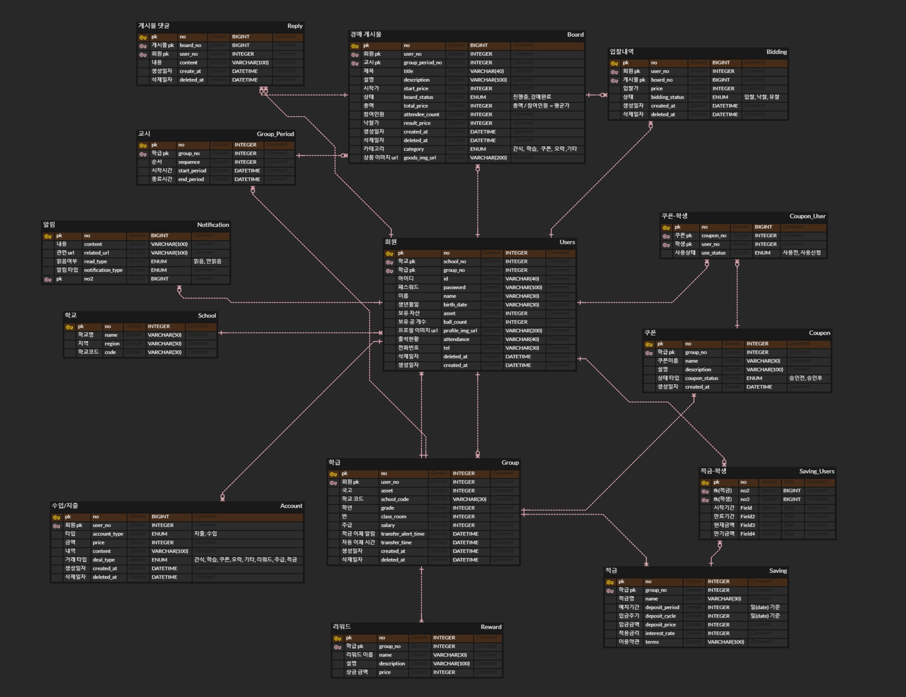

# 0124

```text
상세기능 롤백
상세기능 추가
ERD 수정

코치님들의 소중한 자문
발표준비
```

---

### 1. 상세기능 롤백

어제 미팅이후 현물이 주는 부정적인 영향을 무시할 수 없어서\
현물거래를 쿠폰으로 전면 전환하는 과정을 거쳤다.

하지만 발표준비를 진행하는 도중, 우리가 기획한 대부분의 기능이 
목적성과 기능성을 잃어서 삭제되어야하는 현상이 발생되었다.

아침 시간을 활용하여 의견을 팀장과 주고 받았는데, 피그마를 그리시면서 같은
생각을 하셨다는 말씀을 하셨다.

<br>
따라서, 팀원들과 의견을 공유해보고 결정해보기로 하고, 스크럼 시간을 활용하여
의견을 교환했다.

> 쿠폰 전환시 발생했던 문제
> 
> 1. 통계 시스템이 무의미 해진다.
> 
> 통계 시스템은 우리 서비스에서 자신의 소비습관을 되돌아볼 수 있고, 학급의
> 소비 카테고리를 분석할 수 있는 목적의 기능이었다. 하지만 쿠폰화과 되어버리면
> 카테고리가 사라지게 되고, 해당 기능을 이용할 수 없다.
> 
> 2. 경매 서비스..? 쿠폰 서비스 ..?
> 
> 쿠폰 시스템으로 전환하면서 경매 서비스가 아닌 쿠폰을 쉽게 사용하게 하는 서비스가
> 되어버린 느낌을 받았다. 쿠폰을 쉽게하는 서비스로 경제 금융 교육의 느낌을 살릴
> 수 있을까?라는 의문이 생겼고, 이 프로젝트의 주된 목적이 흐려졌다.
> 
> 3. 캐릭터의 의미가 없어짐
> 
> 쿠폰 경매시스템에는 댓글 기능이 필요가 없다. 따라서, 댓글에 주로 사용되는
> 캐릭터도 사실상 무의미하게 변해버렸다. 캐릭터는 초등학생들이 서비스를
> 이용하게 하는 큰 역할을 하고 있다고 생각하는데, 캐릭터가 없어지면
> 구성했던 메인 역시 다시 구성을 진행해야한다.
> 
> 4. 쿠폰을 사기 위해 적금을 한다..?
> 
> 우리의 적금 시스템을 같은 쿠폰을 사기 위해 진행을 할까? 그럼 더 좋은 쿠폰을
> 만들면 될까? 더 비싼 쿠폰으 목표로 적금을 하게 할까? 하지만, 사실상 더 좋은
> 쿠폰의 리스트업도 이미 수도 없이 해 보았기에 더는 나오지 않는걸 안다.
> 따라서 적금 시스템도 의미가 없어진다.


이런 결론에 도달하게 되었고, 결국 기능을 롤백하기로 결정했다.

### 그럼 기존 시스템(현물)의 문제점이라고 생각했던 점은 ?

이 문제점 같은 경우에는 크게 다음과 같은 두 가지라 생각했다.


1. 시스템 상으로 돈을 벌어서, 현물을 목표로 하게 된다.
 
시스템 상의 게임머니로 돈을 벌어 사용할 수 있는 큰 목표가 현물이 되어버리는 문제가 생긴다면,
우리 서비스의 기획과 멀어지게 된다고 생각했다. 또한, 경매에 올라오는 물건이
터무니 없이 비싼 물건을 올리게 된다면, 해당 물건의 출처가 의심될 수 있는 상황이 생기거나,
경매에 올라온 물건을 사재기(비싼척 올리는 경우)하는 경우 등 많은 문제점이 생길 수 있다.

<br>
이를 GPT API를 이용하여 해결하기로 하였다.
GPT로 해당 물건의 사진을 입력받아 시장 평균가를 책정하여, 해당 책정가로 부터 일정부분 이내로만
경매 시작이 가능하게 제한한다.
또한, GPT가 책정한 가격이 너무 비싼(기준은 아직 미정)가격일 경우, 올릴 수 없도록 제한한다.
또한, GPT가 인식할 수 없는 사진이라면 경매를 올릴 수 없게 제한한다.


제한이 많다고 생각될 수 있지만, 상품 판매가 주 목적이 아니기 때문에, 최선의 방법이라고 생각한다


목표로 큰 쿠폰을 리스트업 한다.

현물을 목표로 하지 않게 하기 위해서, 또한 돈을 많이 쌓아두는 경우를 대비하기 위해서
아이들이 좋아하는 무형의 좋은 쿠폰을 설정하기로 했다.

앞서, 쿠폰 리스트업이 문제가 됐던 것은, 경매 기능이 없었기에 리스트업이 상당수 필요하기 때문이었는데,
현물과의 조화로 비싼 쿠폰 리스트업을 3개로 하면 적당하다는 의견이 나왔다.

3개정도는 리스트업이 가능하지 않을까.

<br><br>

2. 관리자가 결국 다 해야 한다.

이 역시 GPT가 상품 검수를 1차적으로 진행한다면 충분히 해결될 것으로 기대한다.
또한, 초기가격 역시 일정수치 이상을 넘어가게 된다면 올릴 수 없으므로
해당 문제는 고려하지 않아도 된다는 의견이다.


---

### 2. 상세기능 추가

1. GPT

앞선 설명으로 생략한다.

2. 권장 주급 추천

현재의 반 아이들이 보유한 비드, 쿠폰, 경매 물가 등을 고려하여
적당한 주급을 관리자에게 추천해준다.

이는 관리자의 일을 덜어줄 것으로 기대한다.

3. 아이들이 원하는 쿠폰을 신청할 수 있다.

해당 학급만의 룰이 있을 경우, 이를 쿠폰으로 만들어 관리자가 판매할 수 있다.


4. 낙찰 경매건에 대해, 다른 입찰자들의 입찰가를 확인 가능하다.

내가 낙찰된 물건이 적당한 가격으로 낙찰되었는지, 아이들이 스스로 판단할 수 있도록
하는 시스템이다.


---


### 3. ERD 수정




상세기능 롤백과, 추가기능을 바탕으로 ERD를 수정했다.

또한, 어제 고민한 FK 관련한 문제, 정규화 비정규화에 관한 문제도 함께 토론하여 수정했다.

최종적으로 조금만 더 수정하면 마무리 될 것으로 기대한다.


---


### 4. 코치님들의 자문

팀프로젝트 진행중 궁금한 점에 대해 코치님들의 자문을 구했다.

1. FK를 없애는 것에 대해.

```text
FK를 없애는 것에 문제가 우려되었는데 큰 문제가 되지 않는다.
JPA를 사용한다고 하더라도 @ManyToOne 등의 어노테이션에서 FK false 설정이 가능해
실상 JPA와는 관련 없이 생각해도 된다.

참조가 진짜로 필요한 지를 많이 고려해 볼 것.
```

2. 적금 테이블 구성에 대해

적금 테이블이 회원과 1:1 관계는 아니지만, 우리 시스템 상 2개의 적금만 존재하기 때문에
회원 테이블에 합치는 것을 고민하고 있었다.

확장성과 성능중 어느것을 택해야 하는가?
```text
적금 테이블을 분리하는 것이 좋아보인다.
회원과는 성격이 다르고, 적금이라면 추가 가능성이 있기 때문에
확장성을 고려하는것이 서비스 적으로 나은 판단이다.
```


3. 발표에 대해

데일리 컨텐츠에서 컨설턴트님께서 ERD와 명세서를 띡 붙여놓으면 사실 의미가 별로 없다고 하셨다.
너무 적극적으로 공감되었다. 나도 다른팀이 발표할때 ERD가 나오면 고개를 돌리곤 했으니 ,,

이를 해결한 방안을 어제부터 고민하였지만, ERD를 참신하게 보여줄 방법이 도저히 떠오르지 않아
자문을 구하였다.

```text
기획과 설계 발표이니까.
프로젝트 기획에 더 힘을 실어 주어라.
기획을 탄탄히 한 것을 보여준다면, 설계 단계는 눈에 띄지 않아도 돋보일 것이다.

ERD를 눈에 띄게 하고 싶다면, 다른 팀과의 차별점을 강조해라.
당연히 다른팀도 다 진행한 부분을 발표하면 관심이 가지 않을것이다.
비정규화 같은 부분을 예시로 부분만 보여주면 좋겠다.
```

이 자문 덕분에 발표를 어떤 식으로 진행해야할 지 감이 좀 잡혔다고 생각한다.
역시 ... 굳..

---

### 5. 발표준비

발표 순서 정리  -> 코치님들의 자문 -> PPT 수정 및 발표 기획


---


### 240124 개인회고

KEEP(지속할 것)
```
1. 코치님들에게 처음으로 자문을 구하였다. 우리끼리 결정이 잘 나지 않았던 문제나
모르는 부분에 관해 아주 자세하고 친절히 알려주셨다. 또한 발표 방향에 관해 갈피를 
못잡던 부분도 도움을 받고나니, 어떻게 할 지 바로 방향을 잡을 수 있었다.
코치님들 최고

2. 더 나은 서비스, 더 나은 프로젝트를 위해 끊임없이 수정한다. 무언가를 추가하기에
시간이 많이 늦은 것은 사실이지만, 더 완성도 있는 프로젝트를 위해 좋은 의견이나 기능이
생각나면 바로 말하고, 팀원들도 좋게 들어준다. 심지어 잠은 죽어서 자기로 약속까지 했다.
아직 개발을 시작하진 않았지만, 3주 뒤에 완성될 우리 프로젝트가 기대된다.
```


PROBLEM(문제가 된 것)
```
1. 복도에서 떠들다가 늦게 들어왔다.. 기본은 지키자 승헌아
```


TRY(다음에 시도할 것)
```
1. 일정 세세히 짜기. 기능 개발 우선순위 책정하기. 
시간이 모자를 경우를 대비해야한다.
```