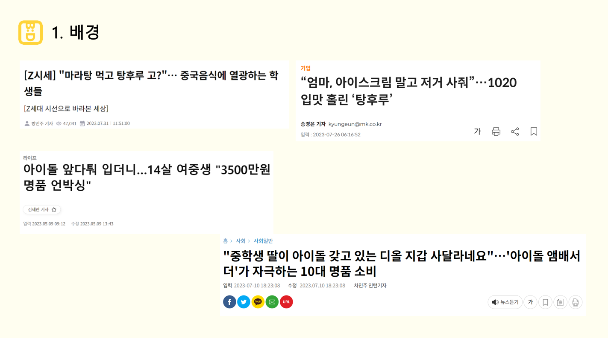
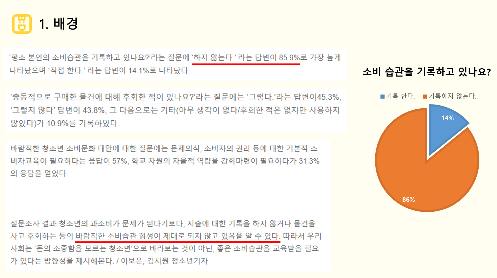
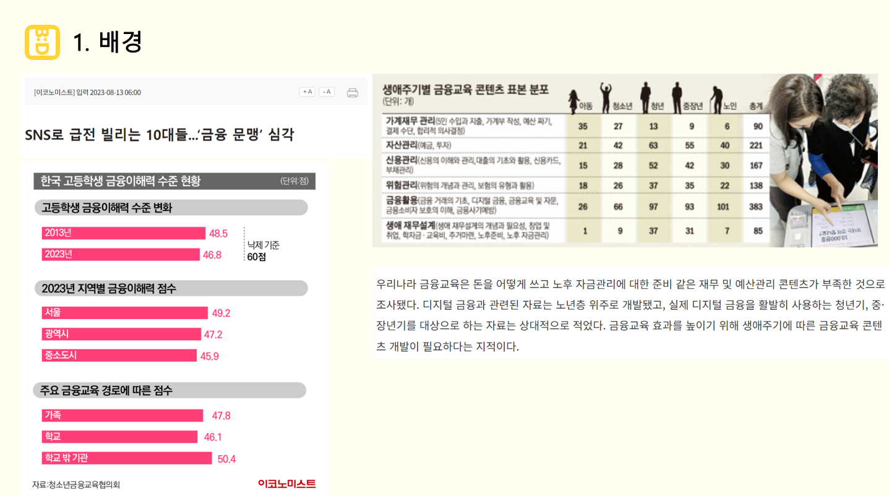
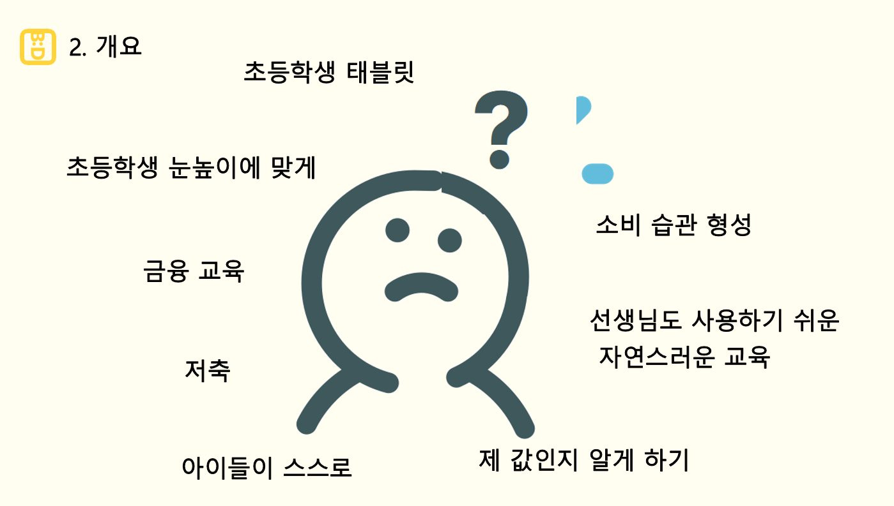
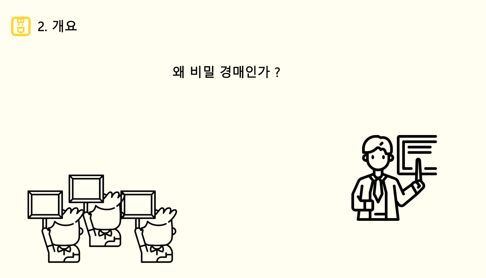

# 0125

```text
발표자료 조사
발표자료 수정
발표준비
```

---

## 1. 발표자료 조사 & 수정 & 준비

PPT담당이신 팀원(배민지)께 초기 PPT를 전달받고, 발표 담당인 나의 발표 스타일에 맞게
자료를 수정했다.

발표 수정을 진행하면서, 기획에 조금 더 힘을 싣고, 기획 배경에 조금 더 명확한 의도가 드러날
수 있도록 자료를 조사하였다.






단순히 기획 배경을 금융 교육에 초점을 맞추기보다,
공감을 이끌어내는 전략으로 수정하였다.

> 요즘 유행하는 탕후루는 성인인 내가 보기엔 너무 비싼 가격이라 생각 된다.
> 반면에, 초등학생 사이에선 "마라탕후루" 라는 신조어가 있을 정도로 탕후루에 
> 아주아주 인기 간식이다.
> 
> > "마라탕후루"는 하루에 마라탕과 탕후를 즐긴다는 신조어이다.
> 
> 추가로 마라탕 이외에도 청소년들의 소비습관에 관한 기사로 공감을 이끌어 내려고
> 노력했다.
> 
> 또한, 전문적인 자료 (청소년자치연구소의 설문, 청소년금융교육협의회 조사 결과)를 바탕으로
> 구체적인 문제점을 제시하여 사태의 심각성을 부각하였다.





> 배경 이후에는 서비스를 기획한 과정에서 고민한 점과,
> 서비스 주요 기능이 왜 "비밀경매"인가라는 누구나 할 법한 궁금한 점을
> 소개하며 서비스를 소개하는 방식으로 수정하였다.

이렇게 기획 단계를 발표한 후, 설계단계에서는 특별한 부분이 없기 때문에
설계 과정을 간략하게 설명하고 넘어갈 계획이다.

또한, FE에서 제작한 목업이 상당히 잘 나왔다고 생각해서,
피그마의 프로토타입을 이용하여 서비스의 전반적인 부분을 소개할 예정이다.


---

### 240125 개인회고

KEEP(지속할 것)
```
1. 지금까지 싸피에서 지내면서 다른 조, 다른 반 친구들과 진행상황을 공유하는 상황이 빈번히 
발생했다. 오늘도 점심시간에 우리 목업 장난 없다고 자랑하다가, 우리 목업을 보고싶다는 친구에게
보여주는 일이 생겼는데, 우리의 서비스를 처음 보는 시각으로 어떻게 생각하는 지 솔직한 생각을 
들을 수 있는 시간이었다.

컨설턴트님이 말씀하신 것처럼 우리가 우리의 서비스를 바라보는 시각은 항상 긍정적이기 때문에,
가끔 다른 사람들과 공유를 하면서, 우리 서비스에 대한 생각을 들어보는 것이 너무 좋게 느껴졌다.
```


PROBLEM(문제가 된 것)
```
1. 나도 PPT를 잘 만들 수 있다는 생각과, 우리 팀장님이 하시는 일을 줄여드리고 싶은 마음에,
PPT에 시간을 많이 투자했는데, 결국 다시 팀장님이 대대적인 수정 작업에 들어가셨다.ㅠ

내가 머릿속에 그리는 그림을 적당히 작성하여 넘기고, 다른 일에 시간을 더 투자하였으면
더 팀에 도움이 되지 않았을까 생각이 든다. 욕심내지 말자.
```


TRY(다음에 시도할 것)
```
1. 내일 발표다. 떨린다. 발표를 마치고 팀원들의 피드백을 들어보는 시간을 갖고 싶다.
전체적인 진행, 어색한 점, 보완할 점이 있다면 가감없이 듣고 싶다.
```