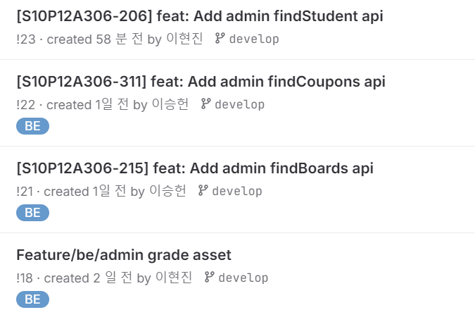
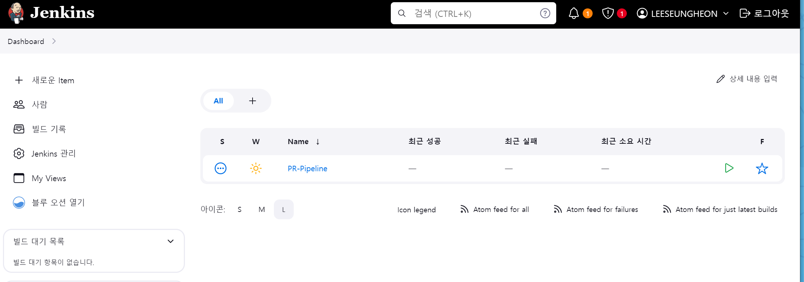

# 0129

주말
```text
경매 조회 API 작성
쿠폰 조회 API 작성
```

```text
백엔드 배포 설정
```

---

## 1. 주말동안 경매, 쿠폰 조회 API 작성




---


## 2. 백엔드 배포 설정


EC2 내에 docker, jenkins, nginx 설치 및 연동\
jenkins 한글 설정\
jenkins pipeline 시작




---


### 240129 개인회고

KEEP(지속할 것)
```
1. 배포를 해 본 경험이 아예 없지만, 현진이가 잠을 줄여가며 미리 배포를 경험해보고 노션에 잘 정리해 준 덕분에
해당 글을 보면서 순조로히 배포를 진행하고 있다. 물론 여러가지 문제에 부딪히긴 했지만, 이렇게 팀을 위해
노력하는 사람이 BE 팀장이라니 믿음직스럽다.

2. 지라를 처음 써 보는 사람이 많아서 처음엔 힘들었지만, 모두 아름다운 번다운 차트를 위해 열심히 이슈를
작성하고 일정을 지키려 노력한다. 그러다 보니 우리가 전국 이슈개수 1등 팀이 되어 있었다.
앞으로 리뷰 갯수도 1등 팀이 되기위해 PR을 열심히 날리는 팀이 되었으면 좋겠다.
```


PROBLEM(문제가 된 것)
```
1. API 명세를 빠른 시일 내에 통합, 정리해 주어야 FE팀에서 편하게 작업을 할텐데 그러지 못하고 있다.
심지어 사정상 문서가 여러 개라 FE팀에서 약간의 혼란이 갖은 것 같다. 문서 작업을 미루지 말고
제때 해야겠다. 
```


TRY(다음에 시도할 것)
```
1. 문서 통합, 정리
2. jenkins 파이프라인 구축
```