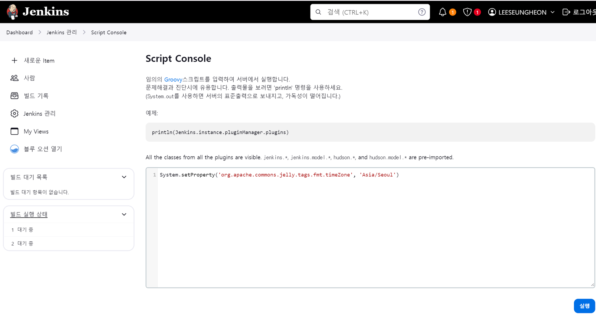
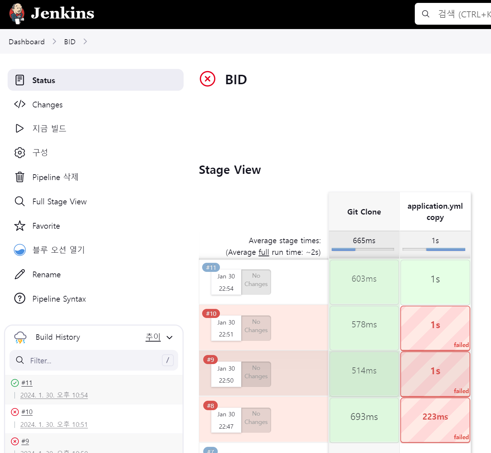

# 0130

```text
도커, 젠킨스, nginx 재설정
jenkins 파이프라인 작성
jenkins 테스트
Response 형식 토의
```

---

## CI/CD

금일 하루종일 jenkins 오류때문에 jenkins 창을 띄우지 못했다.
8080 포트를 쓰지 않고 있음에도, 쓰고 있다는 warning과 함께
jenkins 포트 연결을 하지 못했는데, 이유를 찾지 못했다.

다만,, 집에 오고 다시 재 설치를 하니 정상 작동하는 것을 확인하였다.
무엇을 잘못했을까 ..? 


### 1. 젠킨스 시간설정


### 2. pipeline 작성



현진이의 배포 경험을 정리한 노션을 바탕으로
pipe 라인을 구성하며 테스트를 진행했다.

> 여기서 spring 설정 파일인 yml 파일은
> jenkins 내부 credentials에 secret file 로 설정하는 것이 좋아보여서, 
> 해당 방법으로 변경하였다.

또한, jenkins 내부의 pipeline script와
gitlab 레퍼지토리에 Jenkinsfile을 통한 pipeline 작성 방식중에
어떤 것이 무슨 장점이 있는지 파악을 하지 못하였다.

내일 해보자 !!


---


### 240130 개인회고

KEEP(지속할 것)
```
1. BE와 FE 나눌 것 없이 모르는 것을 묻고 공유한다. BE, FE 배포 부분, 브랜치 전략 부분,
현진이의 시큐리티 속성 강습까지.. 서로 모르는 것을 공유하며 알아가며 각자 더 성장할 수 있는 시간이었다.

2. 알 수 없는 오류로 우울해 있으니 모두 응원을 해준다. 혼잣말로 투덜거리는 횟수가 점차 늘어나는 것 같은데,
가벼운 장난을 치면서 힘을 낼 수 있도록 응원 해주는 분위기가 좋았다 .
```


PROBLEM(문제가 된 것)
```
1. jenkins 설정이 잘못된 이유를 찾지 못하였다.. 하루종일 jenkins 할아버지를 못 뵌 것이 너무 죄송하다..
집에 와서 다시 해 보니 잘만 되는데, 아직도 이유를 모르겠다. 내일은 잘 되길
```


TRY(다음에 시도할 것)
```
1. jenkins pipeline에 필요한 것에 대해 물어보기
```