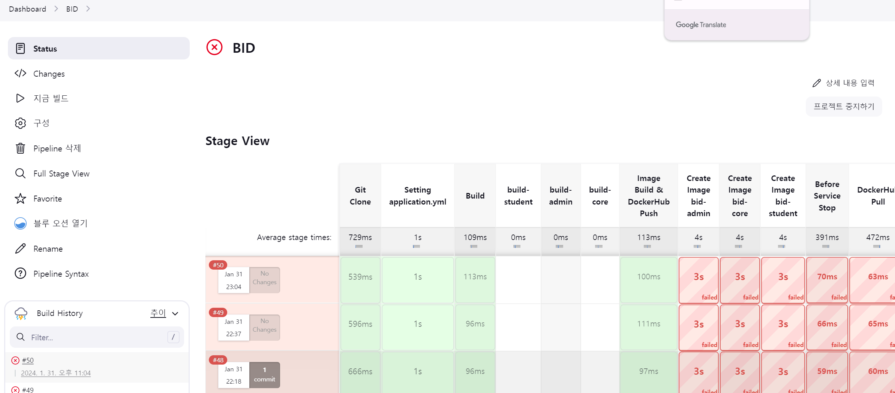

# 0131

```text

코치님 미팅
jenkins pipeline 작성 (spring multi-module)
BE 일정 수정
API 명세 취합

```

---

## 1. 코치님 미팅

오늘 코치님과 컨설턴트님 없이 처음으로 미팅을 진행했다.

1. 일정 관리

전체적인 일정을 체크하시고, 너무 늦진 않은진 체크해 주셨다.
FE는 잘 관리가 되어 있었고, BE는 역할배분 전의 일정이 그대로 있어서 다시 수정 작업을 거쳐야하는데,
바쁘다보니 관리가 잘 되고 있지 않았다.

미팅이 끝나고는 전반적인 수정 작업을 거쳤다.

2. QnA

FE는 상대적으로 배포가 간단하다고 한다.
나는 배포 운영에 대해 잘 몰라서, 이제야 막 알아보는 참인데, 백엔드의 개발서버와 운영서버를
따로 두어 Pipe 라인 구성을 하는 것이 어떤 지, 경험해 보신 적이 있으신 지 질문을 드렸다.

코치님께서는 공통(사용), 특화(미사용), 자율(사용)으로 하셨는데, 특화때 개발서버와
운영서버를 따로 두지 않아서, 역체감이 심하셨다고 한다. 따라서 자율때 인프라 담당분께
부탁을 드렸다고 하셨다..

개발서버.. 운영서버 따로 두는 거 어떻게 하는건데,, 너무 어렵다 .. 

3. JIRA 활용 팁

Jira에 대해 간단하게 잘 활용할 수 있는 방식을 소개해 주셨다.
아주 간단하지만 활용도 높은 방식이었다.

하지만 이번 프로젝트에 적용시키기엔 시간이 많이 없을것 같아서, 다음 프로젝트때부터
적용해 보는 방법으로 하고 싶다.

4. 발표 피드백

발표가 진행된지 많이 지났지만, 피드백을 해 주셨다. 사실 발표에 관해 피드백을 듣고 싶었는데,
발표 당일에는 정신이 없었고, 주말이 지나고 나니 너무 오래 지났다고 생각해서 여쭈어보질 못했다.

그런데 코치님께서 적어두신 것들이 있어서, 그 내용을 바탕으로 피드백을 해 주셨다.

- 기획부분(앞부분)은 좋았으나, 프로토타입을 보여주는 부분에서 기능을 그냥 나열하는 듯한 느낌을 받음
- 비밀 경매를 이용하는 이유를 조금 더 강조했으면 좋겠다 !!
- 발표팀들중 첫 시작 부분이 가장 눈에 띄었다.

발표 시간을 조절하려다보니 뒤쪽 발표가 흐지부지되는 느낌을 나도 받았었는데,
이게 참,, 시간을 조절하기 어려운 것 같다.

최종 발표때는 더욱 탄탄하게 준비해야겠다.

> 최종떄는 기술을 위주로 !! \
> 우리팀은 인프라 쪽과 Blender, 그리고 성능테스트를 위주로 준비할 예정이다!


---

## 2. Jenkins...



많은 시행착오를 거치며, 점점 나아가고있다.

제발 되라 !!


---

## 3. BE 일정 수정 & API 명세 취합

코치님과 면담을 하면서 부족하다고 느꼈던 부분이다.

상세 일정은 Jira에 자세히 나와 있으니, FE와 같은 방식으로 일정을 수정하였다.
일관성을 주기도 하고, 작업에 많은 시간을 들이지 않아도 되는 좋은 방법이었다.


API 명세는 보기 편하게 취합을 하여 변경하였다.\
FE에서 알아보기 편하게 하는 것을 1순위로 작성하였으며,
담당자와 진행 여부를 표시하여, 진행 상태를 빠르게 볼 수 있도록 수정하였다.


---


### 240131 개인회고

KEEP(지속할 것)
```
1. 코치님과 팀 미팅을 진행하니, 코치님의 경험을 바탕으로 질문을 던질 수 있다는 것이 너무 좋았다.
내가 인프라 담당이 된 만큼, 코치님이 프로젝트를 진행하셨을 때 인프라쪽에서 개발서버와 운영서버를
나누셨었는지 여쭈어 보고, 어떻게 느끼셨나 자세히 들었고 큰 도움이 됐다.

그리고 지난 발표에 대한 피드백과, 전체적인 진행 일정을 봐주시고,
FE팀도 여러가지 몰랐던 질문들을 하면서, 우리팀에게 많이 이로운 미팅 시간이었다.

2. Jenkins의 문제는 SSAFY의 포트 문제였다..... 하하..
이런 사소한 문제를 늦게 알아채서 시간을 날렸다는 표현을 사용했는데, 우리팀은 항상 긍정적이라
시간을 날린게 아니라 더 깊게 공부하는 좋은 시간으로 생각하라고 해줬다. 덕분에 마인드를
고쳐 더 열심히 노력하게 되었다.

3. 네잎클로버 이벤트 우리팀이 독점했다. 다른팀에겐 미안하지만, 우리팀 깊티는 챙겨줘야지,,
```


PROBLEM(문제가 된 것)
```
1. FE팀에게 API 제공이 늦어지고 있다. FE팀에서 AXIOS 통신으로 데이터를 받아왔을때,
보여지는 화면 구성을 빠르게 할 수 있도록 해야하는데, 배포가 늦어지면서 전체적인 일정이
뒤로 밀리는 느낌이다. 좀 더 분발하자 !
```


TRY(다음에 시도할 것)
```
1. 다른 팀의 Jenkins Pipeline 설정 참고하기
```