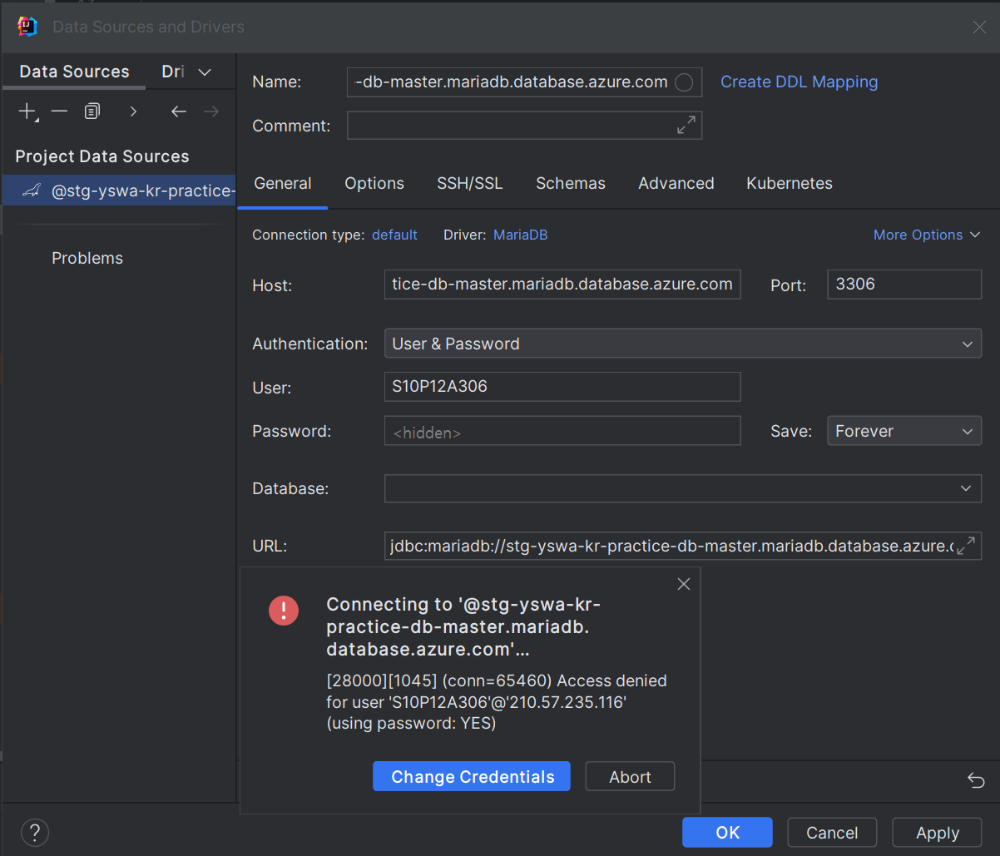
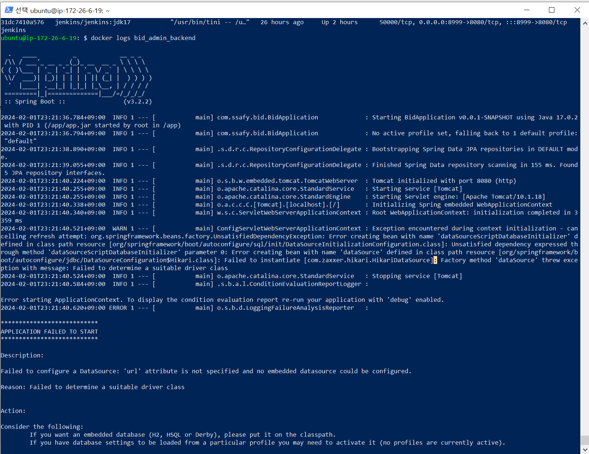

# 0201

```text

CI/CD
- jenkins pipeline 수정 (spring multi-module)
- Add Dockerfile
- Unable checkstyle
- Set archiveFileName 
- mySQL image install


```

---

## 1. Jenkins

- Spring project 내의 Dockerfile을 못 찾는 문제

`sh "tree"` 명령어를 이용하여 ubuntu 내부에서 프로젝트 구조를 파악 한 후,
경로를 수정하여 해결하였다.


- Spring multi module 을 사용했기 때문에, 사실 Dockerfile이 3개가 필요하다.

따라서 기존 Dockerfile을 3개로 다시 작성하여, 각각의 모듈에 넣어주고 경로를
다시 지정해 주었다.


- 싸피 DB 사용..?? 

기존에 제공되기 때문에 사용하려고 했으나, 접속을 시도하면 denied 되었다고 뜬다.. ?




이유를 도저히 모르겠다.

그리고 1명밖에 접속 안 된다는 제한이 있다고도 해서(확실하진 않다)
그냥 mySQL 이미지를 올려서 사용하기로 하였다.


### 오늘의 결과..


Spring을 띄우기까진 성공했지만,
application.yml의 db url을 수정해도 인식을 잘 하지 못한다.

분명 인텔리제이 상에서는 db 인식이 잘 되는데,,,
내일 해결해야겠다.




---


### 240201 개인회고

KEEP(지속할 것)
```
1. 블로그 쓰기.. 검색하면 내 블로그가 나온다고 하는 사람들이 부쩍 많아졌다.
요즘 소홀했지만, 많이 뿌듯한 감정이 든다. 프로젝트 진행에 있어서도 시간이 남는다면
정리해서 작성해야겠다. 파워블로거가 되는 그 날까지

2. 새로운 것을 많이 얻어가는 프로젝트가 될 것 같다. 인프라 경험이라던지,
SpringDocs 적용도 시간이 남으면 하기로 했고, 성능 테스트 툴을 이용하여
성능도 개선할 예정이다. 이번 프로젝트에서 얻어가는게 너무 많을 것 같다. 
```


PROBLEM(문제가 된 것)
```
1. SSAFY DB에 접근이 불가능했다.
접근을 시도하면 Access Denied가 뜬다.. 이 것을 해결하려고 시간을 많이 쏟은 것은 안타깝다.

2. 완벽히 이해하고 넘어가지 않았다.
mySQL을 이미지로 설치하면 되는데 그냥 ec2에 설치한다든가, Docker 파일 설정이 안 되어서
Spring 실행이 안 된 것을 늦게 알았다던가. 친구가 Docker hub 왜 쓰냐는 질문에
답을 하지 못했다. 역시 확실히 이해하면서 진행하는게 도움이 될 것이라는 것을 느꼈다. 
```


TRY(다음에 시도할 것)
```
1. 젠킨스 제발 안녕
```