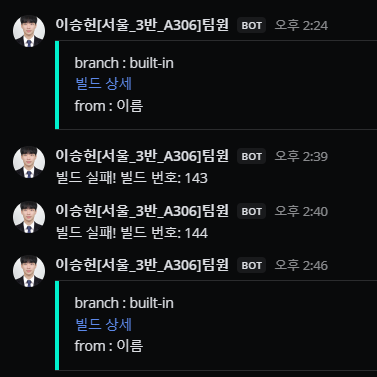

# 0202

```text
- jenkins 빌드 성공 실패 메세지 MM 연동
- jenkins 오류 수정
- 더미데이터 생성
- 주말 계획, 추석 계획, 주 마무리 스크럼
- 싸피 데이 !

```

---

## 1. jenkins

jenkins 최종 수정과 테스트를 진행했다.(거의 최종)

멀티모듈을 빌드하는 과정에서, 병렬 진행으로 약간의 속도를 올리고 있는데,
core 모듈에 있는 queryDSL 객체가 미리 생성되지 않아 문제가 발생했고,
core 모듈을 먼저 빌드 해주게 변경하여 문제를 해결하였다.

이 외에도 여러가지 자잘한 문제가 발견되어서 수정을 진행하였다.


<br>


또한, FE에서 API 요청을 날리는 테스트 역시 성공하였다 .


---
## 2. MM 연동

jenkins build 결과를 MM과 연동하였다.

아직까지는 build 링크정도만 가능하기 때문에, 개인 채널에서 테스트 중이고,
주말중에 수정하여 팀원들이 있는 채널에 사용할 예정이다.





#### 추가 하기
- 빌드 에러 내역
- 빌드 커밋 이름?
- PR 날린 사람 이름 ? 


---
## 3. Dummy 데이터 생성

더미데이터를 일부 생성하여 MySQL에 Insert하였다.

이제 FE에서 API 테스트를 할 수 있을 것이다... ! 

다만, 혼자 생성하기에는 양이 너무 많아서, 일부 데이터 형식만 갖춘 DummyData를 만들고 Insert 쿼리를 공유하였다.
개발을 진행하면서 차차 수정하는 부분이 더 좋을 것이라고 생각했다.

---

## 4. 다음 계획

- 오늘까지 더미데이터 생성(완료)
- 주말까지 이번 주 API 생성
- 다음 주 수 (2/7)까지 API 모두 완료 계획
- 이 후, 예외 핸들러 처리, 테스트 , 성능 테스트 및 최적화 진행 예정
- 시간이 남는다면 WebSocket 통신 적용?? + FE EC2 배포 연결
- 추석 2/12 월요일에는 모두 사당에 모여서 함께 프로젝트 하기로 !


---


### 240202 개인회고

KEEP(지속할 것)
```
1. 오늘 처음으로 하루를 마무리하는 회고를 진행했다. 하룻동안 무엇을 진행했는 지 간략하게 들을 수 있었고,
전체적인 진행상황 파악과 더불어 미래 일정 계획도 이에 맞춰 짜게 되었다. 매일 진행하진 않더라도, 가끔 이런식으로
진행하는 것도 좋겠다는 생각이 들었다.
```


PROBLEM(문제가 된 것)
```
1. 일정을 짤 때, 너무 순조롭게 일이 풀릴 것처럼 짰다. 일정을 널널하게 짜면 여유가 생길까봐 타이트하게 짰었는데,
인프라가 이렇게 오래 걸릴줄 상상도 못했다. 주말을 투자하여 이번 주 일정은 어떻게든 소화할 계획이다.

2. 벌써 특화 팀을 짜는 사람들이 넘쳐나고 있다보니 나도모르게 조급해졌다. 집중력이 조금 떨어진 기분 ..
지금 당장에 더 집중하자.
```


TRY(다음에 시도할 것)
```
1. 인프라 시도했던 것들 다시 볼 수 있게 정리하기. 
```